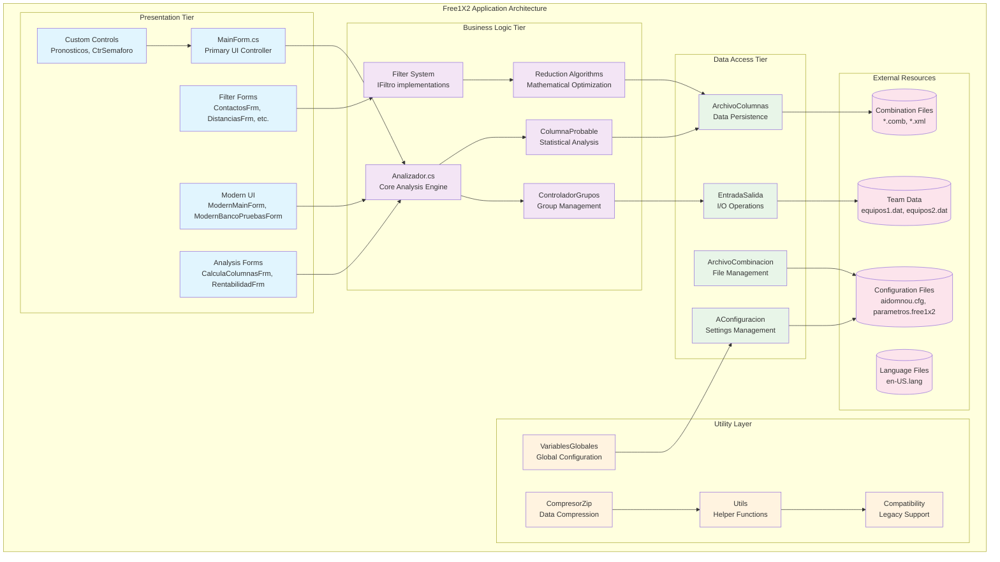
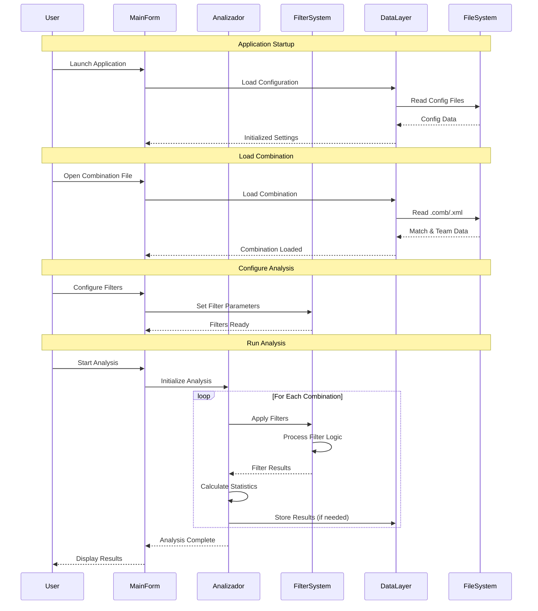
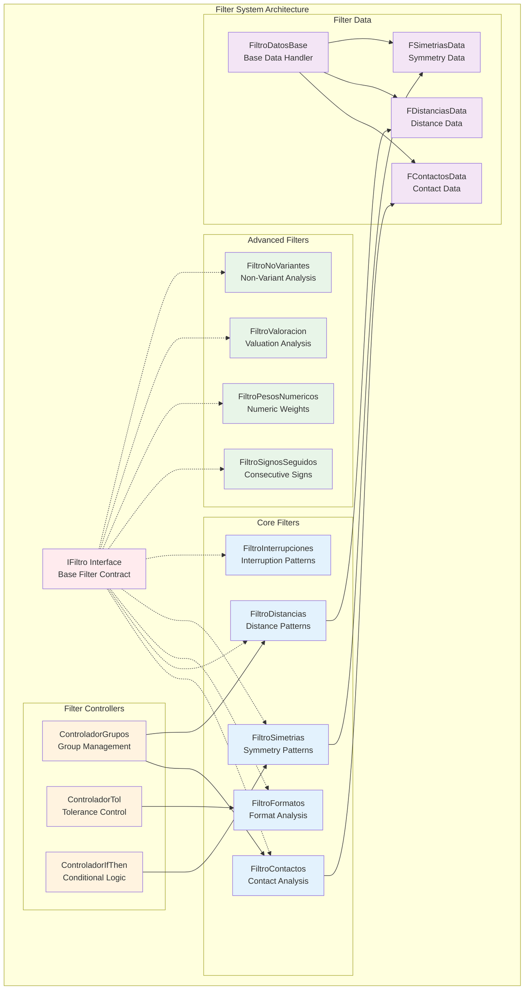
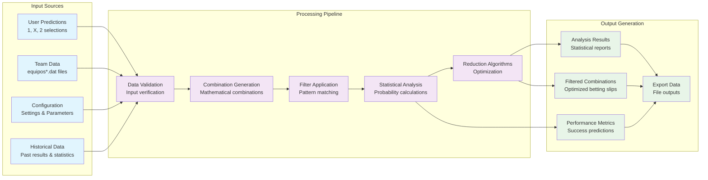
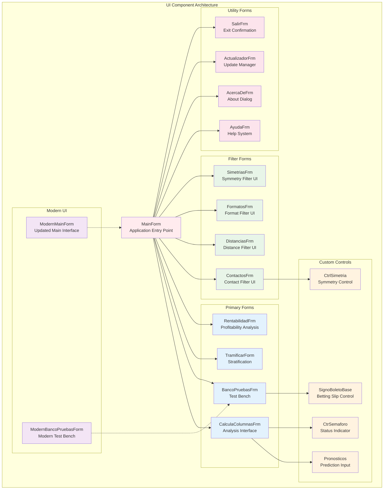
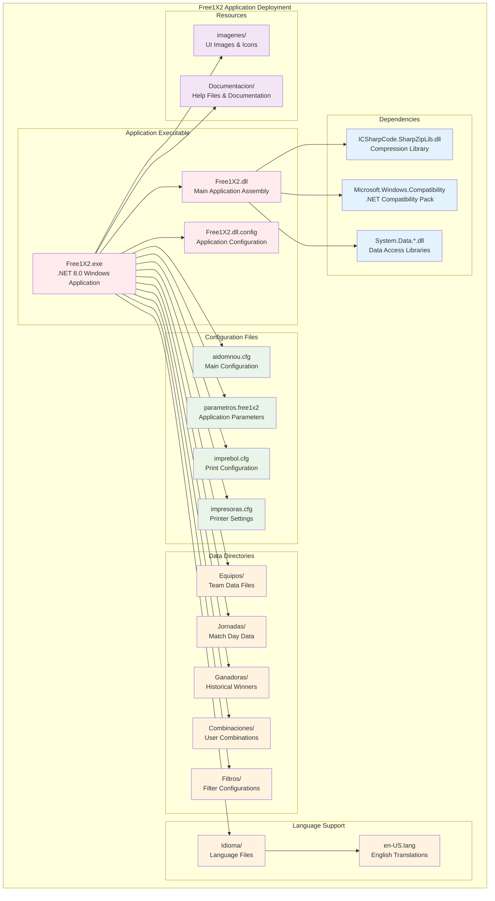

# Free1X2 Application Architecture Diagrams

## High-Level System Architecture



## Component Interaction Flow



## Filter System Architecture



## Data Flow Architecture



## UI Component Hierarchy



## Class Relationship Diagram

```mermaid
classDiagram
    class Analizador {
        -GeneradorColumnas gc
        -string[] pronosticos
        -ControladorGrupos ctrlGrupos
        +AnalizaColumna(long columna)
        +SetPronostico(int partido, string pronostico)
        +CompruebaPronostico(long columna)
    }
    
    class ControladorGrupos {
        -GrupoPartidos gruposPartidos
        +RecalcularControladorGrupos()
        +AnalizaColumna(long columna)
        +AddGrupo(Grupo grupo)
    }
    
    class IFiltro {
        <<interface>>
        +bool EsVacio
        +bool CompruebaPronostico(long columna)
        +string ObtenInformacion()
    }
    
    class FiltroContactos {
        +bool CompruebaPronostico(long columna)
        +string ObtenInformacion()
        -AnalizeContactPattern()
    }
    
    class VariablesGlobales {
        -int numPartidos$
        -string[] separador$
        -Dictionary~string,string~ diccionarioIdioma$
        +InicializarVariables()$
        +GetConfigPath()$
    }
    
    class MainForm {
        -Analizador analizador
        -string nombreArchivoComb
        +MCalcular(object sender, EventArgs e)
        +MAbrirCombClick(object sender, EventArgs e)
        +MSalir(object sender, EventArgs e)
    }
    
    class ArchivoCombinacion {
        -XmlDocument combFile
        -string[] pronosticos
        +AbrirArchivoCombinacion(string fileName)
        +LeeEquipos()
        +LeePronosticos()
    }
    
    %% Relationships
    Analizador --> ControladorGrupos : uses
    ControladorGrupos --> IFiltro : manages
    FiltroContactos ..|> IFiltro : implements
    MainForm --> Analizador : contains
    MainForm --> ArchivoCombinacion : uses
    Analizador --> VariablesGlobales : accesses
    
    %% Styling
    classDef core fill:#e3f2fd
    classDef ui fill:#f3e5f5
    classDef data fill:#e8f5e8
    classDef interface fill:#ffebee
    
    class Analizador,ControladorGrupos core
    class MainForm ui
    class ArchivoCombinacion,VariablesGlobales data
    class IFiltro interface
```

## Deployment Architecture



---

## Architecture Analysis Summary

### Strengths
1. **Clear Separation of Concerns**: Well-defined layers with specific responsibilities
2. **Modular Filter System**: Extensible filter architecture with common interface
3. **Comprehensive Configuration**: Flexible configuration management system
4. **Modern UI Options**: Both legacy and modern UI components available
5. **Robust File Handling**: Multiple file format support with error handling

### Design Patterns Implemented
1. **Strategy Pattern**: Filter system with IFiltro interface
2. **Facade Pattern**: MainForm as central UI coordinator
3. **Singleton Pattern**: VariablesGlobales for global state management
4. **Template Method**: Base classes for data handlers and UI forms
5. **Observer Pattern**: Event-driven UI updates and notifications

### Scalability Considerations
1. **Filter Extension**: Easy to add new filter types
2. **UI Modernization**: Modern UI components can gradually replace legacy forms
3. **Algorithm Enhancement**: Analysis algorithms can be improved without UI changes
4. **Data Format Support**: New file formats can be added through interface implementations

### Performance Optimizations
1. **Lazy Loading**: Configuration and data loaded on demand
2. **Efficient Algorithms**: Mathematical optimizations in reduction algorithms
3. **Memory Management**: Proper disposal of resources and large data structures
4. **Background Processing**: Analysis can run without blocking UI

**Documentation Created**: September 30, 2025  
**Architecture Version**: 1.0 (.NET 8.0 Migration)