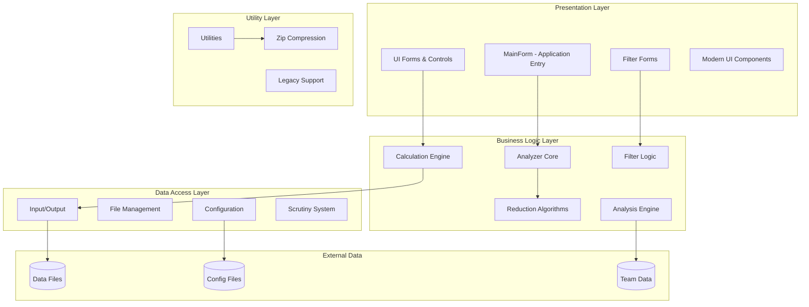
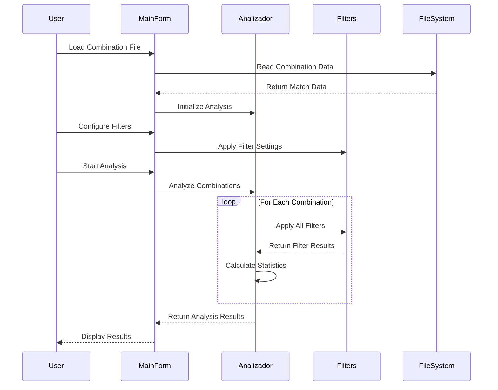

# Free1X2 - Comprehensive Technical Documentation

## Table of Contents
1. [Application Overview](#application-overview)
2. [Architecture Overview](#architecture-overview)
3. [Core Components](#core-components)
4. [Module Documentation](#module-documentation)
5. [Data Flow Diagrams](#data-flow-diagrams)
6. [API Documentation](#api-documentation)
7. [UI Framework](#ui-framework)
8. [Configuration System](#configuration-system)
9. [Development Guidelines](#development-guidelines)

---

## Application Overview

**Free1X2** is a comprehensive football pools (soccer betting) analysis application designed for the Spanish "Quiniela" system. The application provides sophisticated statistical analysis, prediction algorithms, and betting strategy optimization tools.

### Key Features
- **Statistical Analysis Engine**: Advanced algorithms for pattern recognition in football match outcomes
- **Prediction System**: Multiple prediction models based on historical data and team performance
- **Filter System**: Comprehensive filtering capabilities for narrowing down betting combinations
- **Reduction Algorithms**: Mathematical algorithms to reduce the number of betting combinations while maintaining coverage
- **Import/Export**: Support for various data formats and external data sources
- **Multi-language Support**: Internationalization framework with Spanish and English support
- **Modern UI**: Windows Forms-based interface with modern styling and responsive design

### Technical Stack
- **Framework**: .NET 8.0 Windows Forms Application
- **Target Platform**: Windows Desktop (.NET 8.0-windows)
- **Dependencies**: 
  - ICSharpCode.SharpZipLib (compression)
  - Microsoft.Windows.Compatibility (legacy support)
- **Architecture**: Layered architecture with separation of concerns

---

## Architecture Overview



---

## Core Components

### 1. **Analizador (Analysis Engine)**
**Location**: `MotorCalculo/Analizador.cs`

The core analysis engine responsible for processing betting combinations and applying statistical analysis.

```csharp
public class Analizador
{
    private GeneradorColumnas gc;
    private string[] pronosticos;
    private long pronosticoBase;
    private ControladorGrupos ctrlGrupos;
    // ... other members
}
```

**Key Responsibilities**:
- **Column Analysis**: Processes betting combinations (columns) against various filters
- **Group Management**: Manages groups of matches for complex betting strategies
- **Prediction Validation**: Validates predictions against historical data
- **Filter Coordination**: Coordinates multiple filter systems for comprehensive analysis

**Main Methods**:
- `AnalizaColumna(long columna)`: Analyzes a single betting combination
- `SetPronostico(int partido, string pronostico)`: Sets prediction for a specific match
- `CompruebaPronostico(long columna)`: Validates a prediction combination

### 2. **VariablesGlobales (Global Configuration)**
**Location**: `VariablesGlobales.cs`

Central configuration management system that handles application-wide settings.

```csharp
public class VariablesGlobales
{
    private static int numPartidos;
    private static int puntosFijos;
    private static string[] separador;
    private static Dictionary<string, string> diccionarioIdioma;
    // ... configuration variables
}
```

**Key Responsibilities**:
- **Configuration Management**: Loads and manages application settings
- **Internationalization**: Handles multi-language support
- **Global State**: Maintains application-wide state variables
- **Initialization**: Manages application startup configuration

### 3. **MainForm (Primary UI Controller)**
**Location**: `UI/MainForm.cs`

The main application window that coordinates all user interactions and business logic.

```csharp
public partial class MainForm : Form
{
    private string nombreArchivoComb = "";
    private string archivoFiltroCols = "";
    private int grupoPantalla;
    public Analizador analizador = new Analizador();
    // ... UI management
}
```

**Key Responsibilities**:
- **UI Coordination**: Manages all child forms and dialogs
- **Menu System**: Handles application menu and toolbar interactions
- **File Operations**: Manages opening/saving of combination files
- **Analysis Coordination**: Coordinates analysis operations between UI and business logic

---

## Module Documentation

### MotorCalculo (Calculation Engine)

#### Core Classes:

**Analizador.cs**
- **Purpose**: Central analysis coordinator
- **Key Methods**:
  - `AnalizaColumna()`: Processes individual betting combinations
  - `CompruebaPronostico()`: Validates prediction logic
  - `SetPronostico()`: Sets match predictions

**ColumnaProbable.cs**
- **Purpose**: Represents probable betting columns with statistical data
- **Features**: Probability calculations, statistical analysis

**ControladorGrupos.cs**
- **Purpose**: Manages groups of matches for complex betting strategies
- **Features**: Group creation, match assignment, group-based analysis

#### Filter System:

**IFiltro Interface**
```csharp
public interface IFiltro
{
    bool EsVacio { get; }
    bool CompruebaPronostico(long columna);
    string ObtenInformacion();
}
```

**Filter Implementations**:
- `FiltroContactos`: Contact-based filtering
- `FiltroDistancias`: Distance-based pattern filtering
- `FiltroFormatos`: Format-based filtering
- `FiltroSimetrias`: Symmetry pattern filtering
- `FiltroInterrupciones`: Interruption pattern filtering

### EntradaSalida (Input/Output Layer)

**ArchivoCombinacion.cs**
- **Purpose**: Manages combination file operations
- **Features**: XML-based file format, import/export capabilities

**AConfiguracion.cs**
- **Purpose**: Configuration file management
- **Features**: Settings persistence, application configuration

**ArchivoColumnas.cs**
- **Purpose**: Column data file management
- **Features**: Betting combination storage, statistical data

### UI Layer

#### Form Structure:
```
MainForm (Primary Application Window)
├── Filtros/ (Filter Configuration Forms)
│   ├── ContactosFrm
│   ├── DistanciasFrm
│   ├── FormatosFrm
│   └── ... (other filter forms)
├── Controls/ (Custom UI Controls)
│   ├── Pronosticos (Prediction Input)
│   ├── CtrSemaforo (Status Indicator)
│   └── SignoBoletoBase (Betting Slip Base)
└── Modern/ (Modern UI Components)
    ├── ModernMainForm
    └── ModernBancoPruebasForm
```

#### Key UI Components:

**Pronosticos.cs**
- **Purpose**: Prediction input control
- **Features**: Match prediction entry, validation, visual feedback

**CtrSemaforo.cs**
- **Purpose**: Status indicator control
- **Features**: Traffic light-style status display (Red/Yellow/Green)

### Reduccion (Reduction Algorithms)

**Purpose**: Implements mathematical algorithms to reduce the number of betting combinations while maintaining statistical coverage.

**Key Algorithms**:
- **Redu1305Xfsf**: 13-match reduction algorithm
- **ReductorColumnas**: General column reduction system
- **AlgoritmoReduccion**: Base reduction algorithm interface

### Analisis (Analysis Framework)

**AnalisisCombinacion.cs**
- **Purpose**: Comprehensive combination analysis
- **Features**: Statistical analysis, probability calculations, performance metrics

**TransponedorAutomatico.cs**
- **Purpose**: Automatic data transposition for analysis
- **Features**: Data transformation, pattern recognition

---

## Data Flow Diagrams

### Primary Analysis Flow


### Configuration Management Flow


---

## API Documentation

### Core Analysis API

#### Analizador Class

```csharp
public class Analizador
{
    // Primary analysis method
    public void AnalizaColumna(long columna)
    
    // Prediction management
    public void SetPronostico(int partido, string pronostico)
    public string GetPronostico(int partido)
    
    // Group management
    public GrupoPartidos GruposPartidos { get; set; }
    public ControladorGrupos ControladorGrupos { get; }
    
    // Configuration
    public string ArchivoColumnasBase { get; set; }
    public string CompletarCon { get; set; }
    
    // Analysis results
    public int NoColsAnalizadas { get; }
    public int NoColsAceptadas { get; }
}
```

#### Filter System API

```csharp
public interface IFiltro
{
    bool EsVacio { get; }
    bool EsActivo { get; set; }
    bool CompruebaPronostico(long columna);
    string ObtenInformacion();
    void InicializarFiltro();
}
```

### File Management API

#### ArchivoCombinacion Class

```csharp
public class ArchivoCombinacion
{
    public void AbrirArchivoCombinacion(string fileName)
    public string[] LeeEquipos()
    public string[] LeePronosticos()
    public GrupoPartidos LeeGruposPartidos()
    public void GrabarArchivoCombinacion(string fileName, /* parameters */)
}
```

---

## UI Framework

### Form Architecture

The application uses a hierarchical form structure with the MainForm as the central coordinator:

```csharp
// MainForm - Central UI Controller
public partial class MainForm : Form
{
    // Core business logic
    public Analizador analizador = new Analizador();
    
    // Menu event handlers
    void MCalcular(object sender, EventArgs e)      // Start analysis
    void MAbrirCombClick(object sender, EventArgs e) // Open combination
    void MSalir(object sender, EventArgs e)         // Exit application
    void MAyuda(object sender, EventArgs e)         // Show help
}
```

### Custom Controls

**Pronosticos Control**
- **Purpose**: Input control for match predictions
- **Features**: 
  - Support for 1, X, 2 predictions
  - Visual validation
  - Team name display
  - Group assignment

**CtrSemaforo Control**
- **Purpose**: Status indicator with traffic light metaphor
- **States**: 
  - Red: Error/Invalid state
  - Yellow: Warning/Partial state
  - Green: Valid/Complete state

### Modern UI Components

The application includes a modern UI framework in the `UI/Modern/` directory:

- **ModernMainForm**: Updated main form with modern styling
- **ModernBancoPruebasForm**: Modern test bench interface
- **Modern styling guidelines**: Consistent color schemes and control layouts

---

## Configuration System

### Configuration File Structure

The application uses multiple configuration files:

1. **aidomnou.cfg**: Main application configuration
2. **parametros.free1x2**: Application parameters
3. **equipos*.dat**: Team data files
4. **Language files**: Internationalization support

### VariablesGlobales Configuration Management

```csharp
public class VariablesGlobales
{
    // Analysis configuration
    private static bool analizarTodo;
    private static bool analizarVX2;
    private static bool analizarSeguidos;
    // ... other analysis flags
    
    // UI configuration
    private static bool mostrarTsFree;
    private static bool mostrarTsFiltros;
    // ... toolbar visibility flags
    
    // Betting configuration
    private static int numPartidos;
    private static int puntosFijos;
    private static double precioApuesta;
}
```

### Configuration Loading Process

1. **Application Startup**: VariablesGlobales static constructor
2. **Path Resolution**: Determine configuration file locations
3. **File Loading**: AConfiguracion loads and parses files
4. **Variable Assignment**: Apply settings to global variables
5. **UI Initialization**: Configure interface based on settings

---

## Development Guidelines

### Code Style Guidelines (from _LIBRO_DE_ESTILO.txt)

#### Form Standards
- **BackColor**: Bisque
- **Text**: Always set meaningful form titles

#### Button Standards
**Buttons with Text**:
- **BackColor**: DarkSalmon
- **Size**: 128×32 (100×32 for medium buttons)
- **Font**: Microsoft Sans Serif, 8.25pt
- **FlatStyle**: Standard
- **ImageAlign**: MiddleLeft
- **TextAlign**: MiddleRight

**Buttons without Text**:
- **BackColor**: LightSalmon
- **Size**: 24×20
- **FlatStyle**: Standard
- **ImageAlign**: MiddleCenter

#### Image Standards
**Large/Medium Button Images**:
- **Format**: GIF
- **Background**: White
- **Transparency**: White
- **Size**: 32×32
- **Directories**: `imagenes/botones`, `imagenes/botonesCondiciones`, `imagenes/toolbar`

**Small Button Images**:
- **Format**: GIF/BMP
- **Background**: LightSalmon
- **Transparency**: None
- **Size**: 16×16 to 24×24 (square)
- **Directory**: `imagenes/toolbarPq`

### Architectural Patterns

#### Separation of Concerns
- **UI Layer**: Only handles presentation and user interaction
- **Business Logic**: Isolated in MotorCalculo namespace
- **Data Access**: Centralized in EntradaSalida namespace
- **Utilities**: Common functionality in Utils namespace

#### Error Handling
```csharp
// Global exception handling in Program.cs
Application.ThreadException += Application_ThreadException;
Application.SetUnhandledExceptionMode(UnhandledExceptionMode.CatchException);
AppDomain.CurrentDomain.UnhandledException += CurrentDomain_UnhandledException;
```

#### Event-Driven Architecture
- Central event coordination through MainForm
- Menu events prefixed with 'M' (MCalcular, MAyuda, etc.)
- Form-specific event handlers for specialized functionality

### Testing Strategy

#### Unit Testing Approach
- **Business Logic Testing**: Focus on MotorCalculo components
- **Filter Testing**: Comprehensive testing of filter algorithms
- **Configuration Testing**: Validation of configuration loading

#### Integration Testing
- **File I/O Testing**: Verify file operations work correctly
- **UI Integration**: Test form interactions and data flow
- **Analysis Pipeline**: End-to-end analysis workflow testing

---

## Migration Notes (.NET Framework 2.0 → .NET 8.0)

### Compatibility Fixes Applied

1. **StatusBarPanel Compatibility**
   - Issue: ISupportInitialize interface incompatibility
   - Solution: Commented out BeginInit/EndInit calls
   - Files affected: Multiple UI forms with StatusBar controls

2. **Event Handler Verification**
   - Verified all menu event handlers exist and are properly connected
   - Confirmed event handler method signatures match expected delegates
   - Resolved duplicate method definition conflicts

3. **Modern .NET Features**
   - Added high DPI awareness
   - Implemented modern exception handling
   - Maintained backward compatibility for legacy components

### Performance Improvements

- **Startup Performance**: Optimized configuration loading
- **Memory Management**: Improved object lifecycle management
- **UI Responsiveness**: Enhanced event handling and background processing

---

## Conclusion

Free1X2 represents a sophisticated football pools analysis application with a well-structured architecture that has successfully been migrated from .NET Framework 2.0 to .NET 8.0. The application demonstrates good separation of concerns, comprehensive filter systems, and a robust analysis engine suitable for complex betting strategy optimization.

The modular design allows for easy extension of analysis algorithms, filter types, and UI components while maintaining backward compatibility with existing data formats and user workflows.

**Last Updated**: September 30, 2025  
**Version**: .NET 8.0 Migration  
**Documentation Version**: 1.0