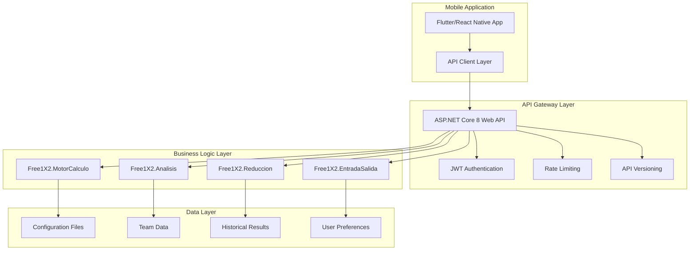

# Free1X2 Web API Backend Development Plan

## Executive Summary

This document outlines the strategy for exposing Free1X2's core functionality as RESTful JSON APIs for mobile application integration. The plan identifies key business functions that can be exposed while maintaining security and performance.

---

## Current Application Analysis

### Core Business Functions Identified

#### 1. **Analysis Engine** (`MotorCalculo.Analizador`)
- **Purpose**: Core betting combination analysis
- **Current Output**: File-based reports and UI updates
- **API Potential**: HIGH - Core functionality needed by mobile app

#### 2. **Filter System** (`MotorCalculo.IFiltro` implementations)
- **Purpose**: Pattern-based filtering of betting combinations
- **Current Output**: Boolean validation results
- **API Potential**: HIGH - Essential for mobile betting strategy

#### 3. **Reduction Algorithms** (`Reduccion` namespace)
- **Purpose**: Mathematical optimization of betting combinations
- **Current Output**: Reduced combination files
- **API Potential**: MEDIUM - Useful for mobile optimization

#### 4. **Statistical Analysis** (`Analisis` namespace)
- **Purpose**: Historical data analysis and predictions
- **Current Output**: Statistical reports and charts
- **API Potential**: HIGH - Valuable for mobile insights

#### 5. **Team Data Management** (`EntradaSalida`)
- **Purpose**: Team and match data handling
- **Current Output**: Data files and UI population
- **API Potential**: HIGH - Essential for mobile match selection

#### 6. **Profit Analysis** (`UI.BancoPruebasFrm`, `RentabilidadFrm`)
- **Purpose**: Profitability calculations and scenarios
- **Current Output**: Financial reports and recommendations
- **API Potential**: MEDIUM - Good for mobile business insights

---

## Proposed API Architecture

### Technology Stack Recommendation



### API Project Structure

```
Free1X2.WebAPI/
├── Controllers/
│   ├── AnalysisController.cs      # Core analysis endpoints
│   ├── TeamsController.cs         # Team and match data
│   ├── FiltersController.cs       # Filter configuration
│   ├── ReductionController.cs     # Combination optimization
│   ├── StatisticsController.cs    # Historical analysis
│   └── ProfitController.cs        # Financial calculations
├── Models/
│   ├── DTOs/                      # Data Transfer Objects
│   ├── Requests/                  # API Request models
│   └── Responses/                 # API Response models
├── Services/
│   ├── AnalysisService.cs         # Business logic wrapper
│   ├── TeamDataService.cs         # Team data management
│   └── ConfigurationService.cs    # Settings management
├── Middleware/
│   ├── ExceptionHandlingMiddleware.cs
│   └── LoggingMiddleware.cs
└── Infrastructure/
    ├── AutoMapperProfile.cs
    └── DependencyInjection.cs
```

---

## API Endpoints Specification

### 🏆 **Priority 1: High-Value APIs (Implement First)**

#### **1. Analysis Controller** - `/api/v1/analysis`

##### `POST /api/v1/analysis/combinations`
**Purpose**: Analyze betting combinations with filters
```json
// Request
{
  "predictions": ["1", "X", "2", "1", "X", "2", "1", "X", "2", "1", "X", "2", "1", "X"],
  "filters": {
    "contactos": { "enabled": true, "min": 2, "max": 8 },
    "distancias": { "enabled": true, "min": 1, "max": 5 },
    "simetrias": { "enabled": false }
  },
  "analysisOptions": {
    "saveResults": false,
    "maxCombinations": 1000,
    "detailedAnalysis": true
  }
}

// Response
{
  "success": true,
  "analysisId": "uuid-here",
  "results": {
    "totalCombinationsAnalyzed": 15000,
    "validCombinations": 1234,
    "rejectedCombinations": 13766,
    "analysisTime": "00:02:15",
    "summary": {
      "bestCombinations": [
        {
          "combination": "1X21X21X21X2XX",
          "score": 95.5,
          "filters": {
            "contactos": true,
            "distancias": true,
            "all": true
          }
        }
      ],
      "statistics": {
        "averageScore": 72.3,
        "standardDeviation": 12.8,
        "confidenceLevel": 0.85
      }
    }
  }
}
```

##### `GET /api/v1/analysis/{analysisId}/results`
**Purpose**: Retrieve detailed analysis results
```json
{
  "analysisId": "uuid-here",
  "status": "completed",
  "detailedResults": [
    {
      "combination": "1X21X21X21X2XX",
      "passedFilters": ["contactos", "distancias"],
      "failedFilters": [],
      "score": 95.5,
      "probability": 0.023,
      "recommendation": "high"
    }
  ],
  "pagination": {
    "page": 1,
    "pageSize": 50,
    "totalResults": 1234
  }
}
```

#### **2. Teams Controller** - `/api/v1/teams`

##### `GET /api/v1/teams/current-matches`
**Purpose**: Get current match data
```json
{
  "currentRound": 15,
  "season": "2025-26",
  "matches": [
    {
      "matchId": 1,
      "homeTeam": "Barcelona",
      "awayTeam": "Real Madrid",
      "matchDate": "2025-10-15T20:00:00Z",
      "predictions": {
        "home": 0.45,
        "draw": 0.25,
        "away": 0.30
      }
    }
  ]
}
```

##### `POST /api/v1/teams/load-combination`
**Purpose**: Load team combination from file/data
```json
// Request
{
  "combinationData": "base64-encoded-combination-file",
  "format": "comb" // or "xml"
}

// Response
{
  "success": true,
  "teams": ["Barcelona", "Real Madrid", ...],
  "predictions": ["1", "X", "2", ...],
  "metadata": {
    "season": "2025-26",
    "round": 15,
    "createdDate": "2025-09-30T10:00:00Z"
  }
}
```

#### **3. Statistics Controller** - `/api/v1/statistics`

##### `POST /api/v1/statistics/historical-analysis`
**Purpose**: Analyze historical performance
```json
// Request
{
  "analysisType": "team_performance", // or "pattern_analysis", "profitability"
  "timeframe": {
    "from": "2024-01-01",
    "to": "2025-09-30"
  },
  "teams": ["Barcelona", "Real Madrid"],
  "parameters": {
    "includePredictions": true,
    "includePatterns": true
  }
}

// Response
{
  "analysisResults": {
    "teamPerformance": [
      {
        "team": "Barcelona",
        "homeWinRate": 0.75,
        "drawRate": 0.15,
        "awayWinRate": 0.10,
        "trends": {
          "improving": true,
          "confidence": 0.82
        }
      }
    ],
    "patterns": {
      "consecutiveResults": {
        "maxHomeWins": 8,
        "maxDraws": 3,
        "patterns": ["WWW", "WDW", "LLL"]
      }
    },
    "recommendations": [
      {
        "type": "betting_strategy",
        "description": "Barcelona shows strong home performance",
        "confidence": 0.85
      }
    ]
  }
}
```

---

### 🎯 **Priority 2: Medium-Value APIs (Implement Second)**

#### **4. Filters Controller** - `/api/v1/filters`

##### `GET /api/v1/filters/available`
**Purpose**: Get available filter types and configurations
```json
{
  "filterTypes": [
    {
      "name": "contactos",
      "displayName": "Contact Patterns",
      "description": "Analyzes contact between consecutive matches",
      "parameters": [
        {
          "name": "minContacts",
          "type": "integer",
          "min": 0,
          "max": 14,
          "default": 2
        }
      ]
    }
  ]
}
```

##### `POST /api/v1/filters/validate`
**Purpose**: Validate filter configuration
```json
// Request
{
  "filters": {
    "contactos": { "enabled": true, "min": 2, "max": 8 },
    "distancias": { "enabled": true, "min": 1, "max": 5 }
  }
}

// Response
{
  "valid": true,
  "warnings": [
    "High filter settings may reduce valid combinations significantly"
  ],
  "estimatedFilterRate": 0.15
}
```

#### **5. Reduction Controller** - `/api/v1/reduction`

##### `POST /api/v1/reduction/optimize`
**Purpose**: Optimize betting combinations mathematically
```json
// Request
{
  "combinations": ["1X21X21X21X2XX", "1X21X21X21X21X", ...],
  "reductionLevel": 3, // 1-5 scale
  "algorithm": "xfsf", // or "jdc", "jlpm"
  "maxOutput": 100
}

// Response
{
  "success": true,
  "originalCount": 1500,
  "reducedCount": 100,
  "reductionRate": 0.067,
  "optimizedCombinations": [
    {
      "combination": "1X21X21X21X2XX",
      "coverage": 0.95,
      "efficiency": 0.87
    }
  ],
  "algorithm": "xfsf",
  "processingTime": "00:00:45"
}
```

---

### 📊 **Priority 3: Specialized APIs (Implement Third)**

#### **6. Profit Controller** - `/api/v1/profit`

##### `POST /api/v1/profit/calculate`
**Purpose**: Calculate profitability scenarios
```json
// Request
{
  "combinations": ["1X21X21X21X2XX"],
  "betAmount": 10.0,
  "prizeStructure": {
    "category14": 1000000.0,
    "category13": 50000.0,
    "category12": 1000.0
  },
  "scenarios": [
    {
      "name": "conservative",
      "winProbability": 0.15
    }
  ]
}

// Response
{
  "profitabilityAnalysis": {
    "scenarios": [
      {
        "name": "conservative",
        "expectedReturn": 150.5,
        "roi": 15.05,
        "breakEvenProbability": 0.067,
        "riskLevel": "medium"
      }
    ],
    "recommendations": [
      {
        "action": "increase_bet",
        "reason": "High probability scenario",
        "confidence": 0.78
      }
    ]
  }
}
```

---

## Implementation Steps

### Phase 1: Core API Development (Weeks 1-4)
1. **Create ASP.NET Core 8 Web API project**
2. **Extract business logic from Free1X2.MotorCalculo**
3. **Implement Priority 1 APIs (Analysis, Teams, Statistics)**
4. **Add authentication and authorization**
5. **Create comprehensive API documentation**

### Phase 2: Enhanced Features (Weeks 5-6)
1. **Implement Priority 2 APIs (Filters, Reduction)**
2. **Add rate limiting and caching**
3. **Implement comprehensive logging**
4. **Add API versioning support**

### Phase 3: Advanced Features (Weeks 7-8)
1. **Implement Priority 3 APIs (Profit analysis)**
2. **Add real-time notifications (SignalR)**
3. **Implement batch processing for large analyses**
4. **Performance optimization and testing**

### Phase 4: Production Readiness (Weeks 9-10)
1. **Security hardening**
2. **Load testing and optimization**
3. **Monitoring and alerting setup**
4. **Deployment and DevOps pipeline**

---

## Technical Requirements

### Dependencies to Add
```xml
<PackageReference Include="Microsoft.AspNetCore.OpenApi" Version="8.0.0" />
<PackageReference Include="Swashbuckle.AspNetCore" Version="6.5.0" />
<PackageReference Include="AutoMapper" Version="12.0.1" />
<PackageReference Include="AutoMapper.Extensions.Microsoft.DependencyInjection" Version="12.0.1" />
<PackageReference Include="Serilog.AspNetCore" Version="8.0.0" />
<PackageReference Include="Microsoft.AspNetCore.Authentication.JwtBearer" Version="8.0.0" />
<PackageReference Include="Microsoft.AspNetCore.RateLimiting" Version="8.0.0" />
<PackageReference Include="FluentValidation.AspNetCore" Version="11.3.0" />
```

### Code Extraction Strategy

1. **Create Service Layer**:
   ```csharp
   public interface IAnalysisService
   {
       Task<AnalysisResult> AnalyzeCombinationsAsync(AnalysisRequest request);
       Task<AnalysisStatus> GetAnalysisStatusAsync(string analysisId);
   }
   ```

2. **Wrap Existing Logic**:
   ```csharp
   public class AnalysisService : IAnalysisService
   {
       private readonly Analizador _analizador;
       
       public async Task<AnalysisResult> AnalyzeCombinationsAsync(AnalysisRequest request)
       {
           // Configure Analizador from request
           // Execute analysis
           // Convert results to API response format
       }
   }
   ```

3. **Extract File Operations**:
   - Replace file I/O with in-memory operations
   - Convert file-based results to JSON responses
   - Implement optional file export for backwards compatibility

---

## Security Considerations

### Authentication & Authorization
- **JWT-based authentication**
- **Role-based access control (Admin, User, Guest)**
- **API key management for mobile apps**

### Rate Limiting
- **Per-user rate limits based on subscription tier**
- **Analysis complexity-based throttling**
- **DDoS protection**

### Data Protection
- **Input validation and sanitization**
- **Output data filtering (no sensitive info)**
- **Secure configuration management**

---

## Performance Optimization

### Caching Strategy
- **Redis cache for frequently accessed data**
- **In-memory cache for team data**
- **Response caching for static content**

### Asynchronous Processing
- **Background jobs for large analyses**
- **SignalR for real-time progress updates**
- **Queue-based processing for optimization tasks**

### Database Considerations
- **Consider migrating from file-based to database storage**
- **Implement read replicas for statistics**
- **Archive old analysis results**

---

## API Selection Checklist

Please review and select which APIs you want to implement:

### ✅ **Recommended for Mobile (High Priority)**
- [ ] Analysis Engine (`/api/v1/analysis/*`)
- [ ] Team Management (`/api/v1/teams/*`)
- [ ] Historical Statistics (`/api/v1/statistics/*`)

### 🎯 **Optional Features (Medium Priority)**
- [ ] Filter Configuration (`/api/v1/filters/*`)
- [ ] Combination Reduction (`/api/v1/reduction/*`)

### 📊 **Advanced Features (Lower Priority)**
- [ ] Profit Analysis (`/api/v1/profit/*`)
- [ ] Real-time Updates (SignalR)
- [ ] Batch Processing APIs

### 🔧 **Infrastructure APIs**
- [ ] User Management
- [ ] Configuration Management
- [ ] Health Checks and Monitoring

---

## Next Steps

1. **Review this plan and select desired APIs**
2. **Prioritize implementation order**
3. **Define mobile app requirements**
4. **Create detailed technical specifications**
5. **Begin Phase 1 development**

**Estimated Total Development Time**: 8-10 weeks for complete implementation
**Minimum Viable Product**: 4-6 weeks (Priority 1 APIs only)

---

**Document Version**: 1.0  
**Created**: September 30, 2025  
**Status**: Awaiting client selection and approval