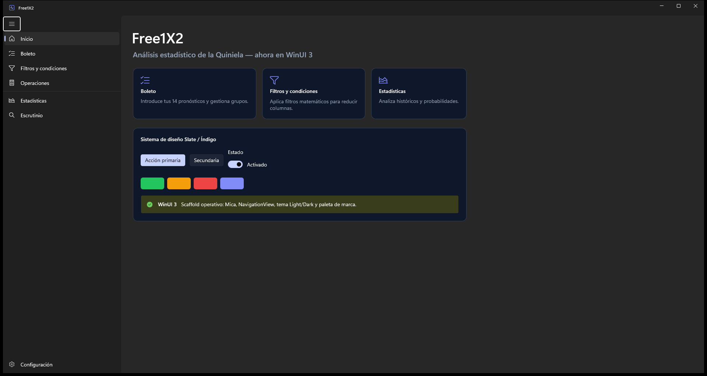
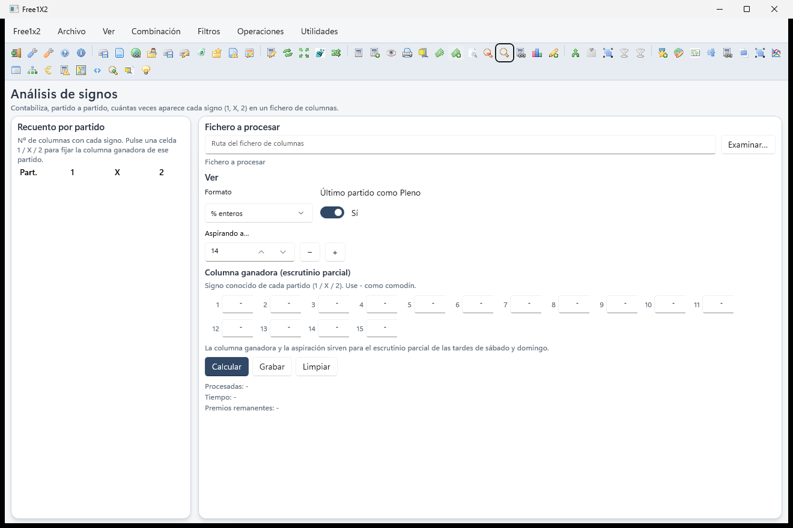
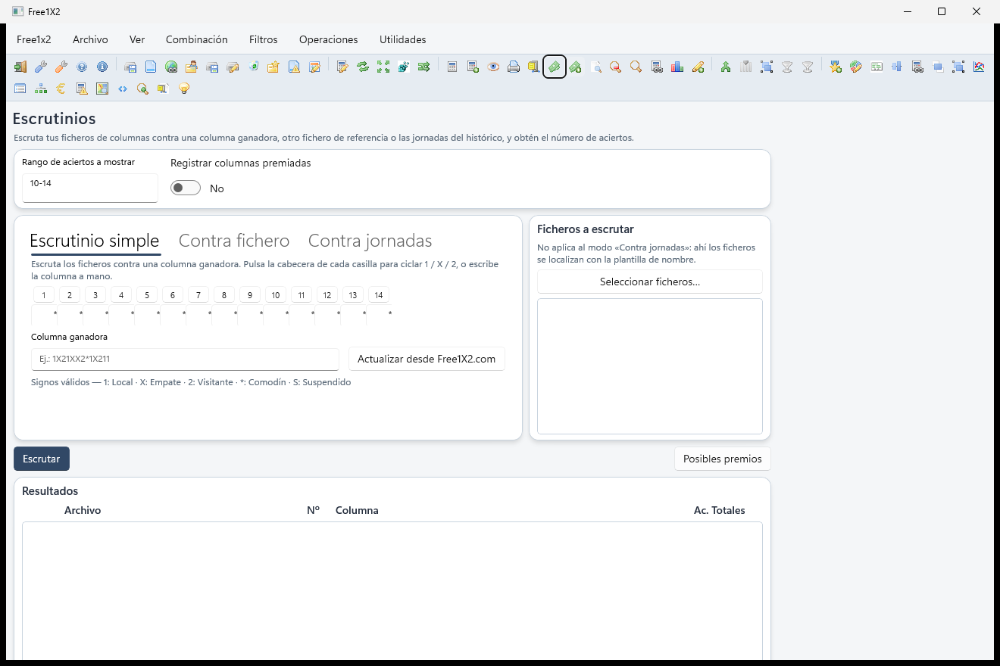
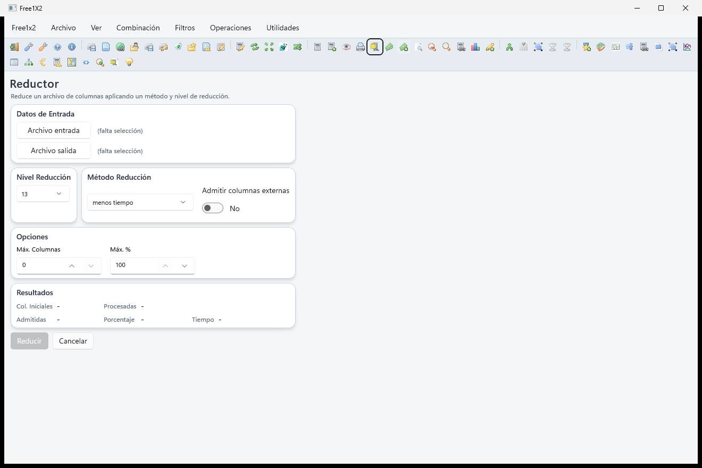
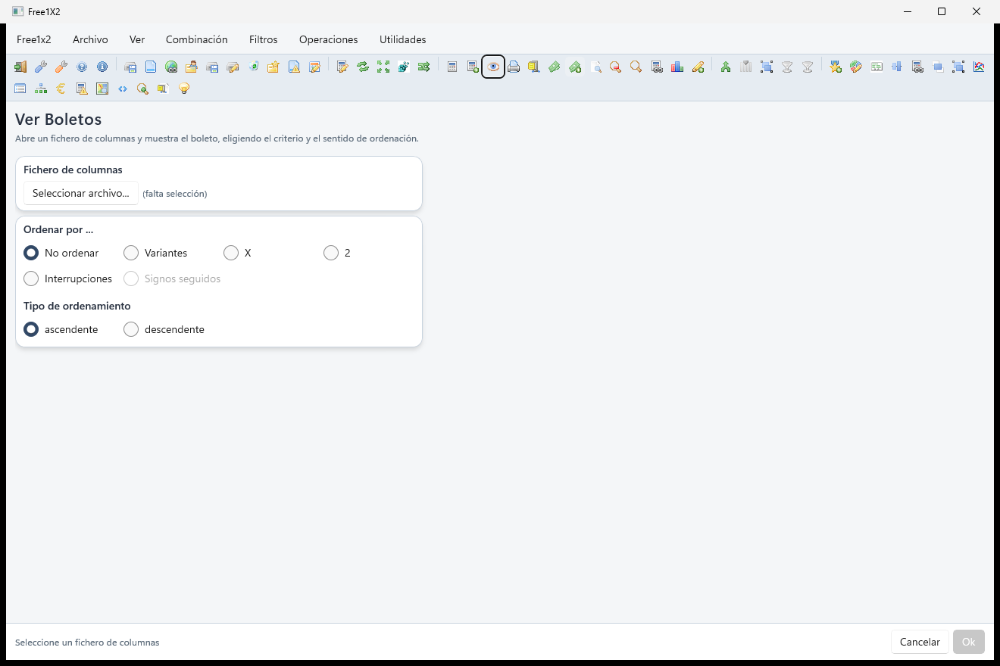
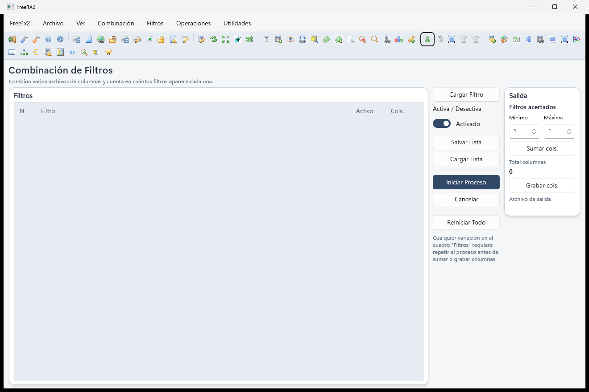
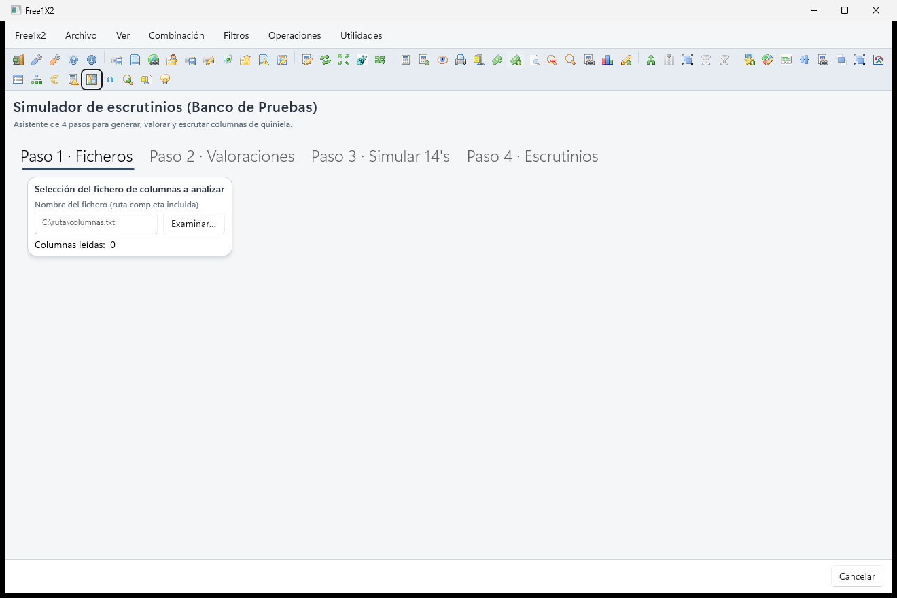
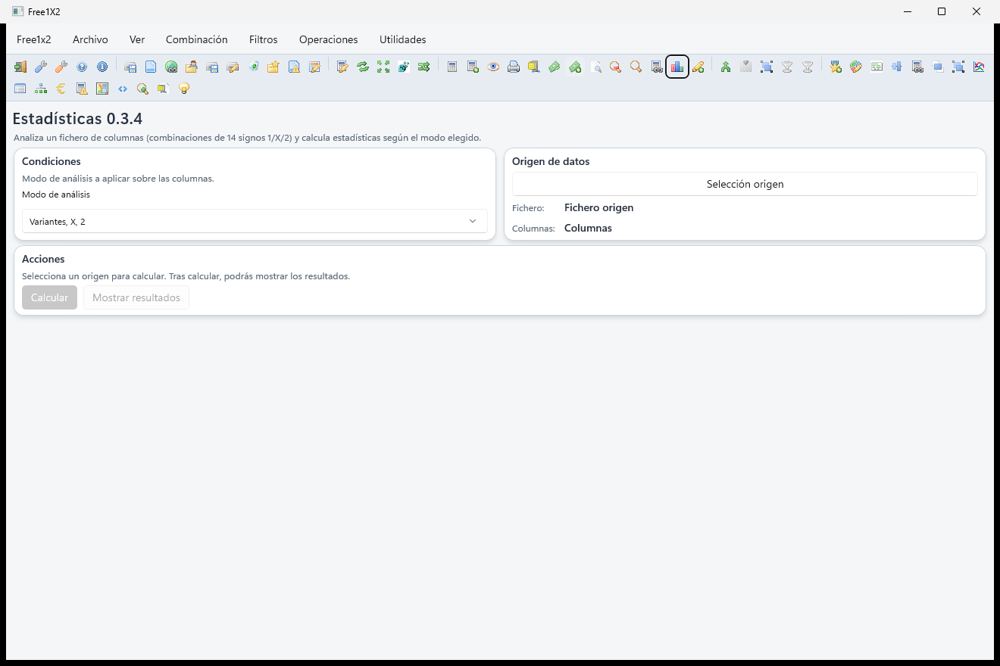
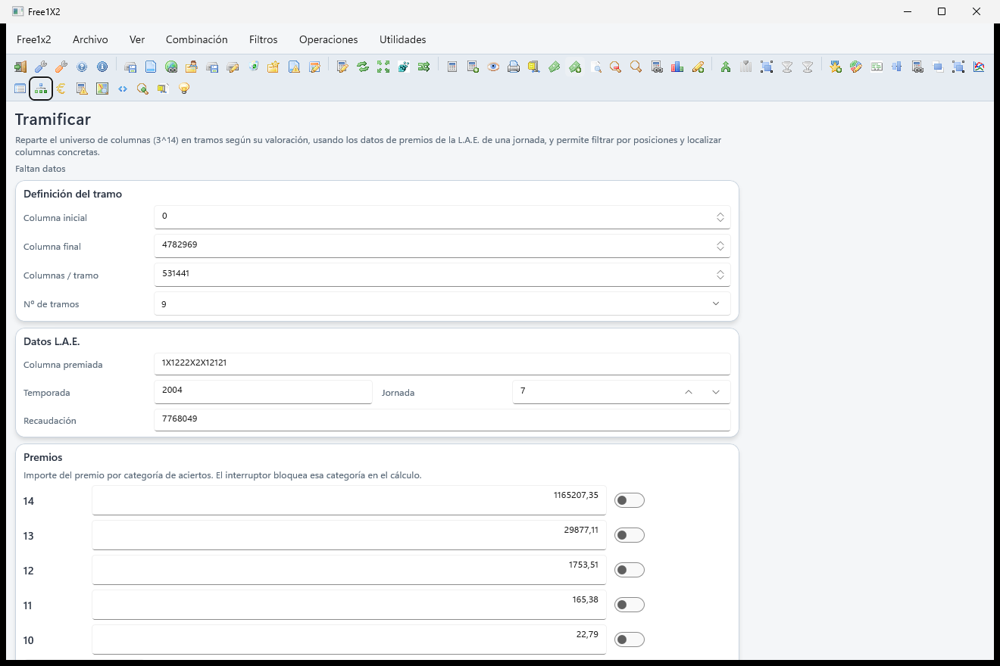
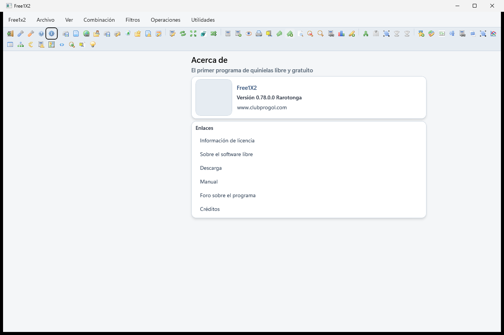

# Free1X2

**Free1X2** es una herramienta de escritorio para Windows de análisis y generación de combinaciones para la **Quiniela** española (14 partidos de fútbol con resultado 1 / X / 2, más el Pleno al 15). Permite construir un boleto, aplicar condiciones y filtros matemáticos, generar y **reducir** columnas de apuesta, escrutar resultados y analizar históricos.

La interfaz se ha **migrado a WinUI 3** (Fluent nativo de Windows), conservando intacto el motor de cálculo del programa original y reproduciendo de forma fiel las pantallas clásicas (108 superficies de UI).

Programa libre bajo licencia **GPLv3** — derivado del proyecto original Free1X2 de Joan Duatis (GPL). Ver [`LICENSE`](LICENSE).

- 🌐 **Web**: [clubprogol.com](https://clubprogol.com)
- 📖 **Manual de usuario**: [`docs/MANUAL_USUARIO.md`](docs/MANUAL_USUARIO.md)
- 🛡️ **Seguridad**: [`SECURITY.md`](SECURITY.md)
- 🗺️ **Plan de migración a WinUI 3**: [`PLAN_MIGRACION_WINUI3.md`](PLAN_MIGRACION_WINUI3.md)
- 📌 **Estado de la migración**: [`ESTADO_MIGRACION_WINUI3.md`](ESTADO_MIGRACION_WINUI3.md)



## Capturas (WinUI 3)

Capturas reales de la interfaz Fluent tras la migración:

|  |  |
|:--:|:--:|
| Análisis de signos | Escrutinios |
|  |  |
| Reductor | Ver boletos |
|  |  |
| Combinar filtros | Banco de pruebas |
|  |  |
| Estadísticas | Tramificar |
|  | |
| Créditos / Acerca de | |

---

## Qué hace

| Área | Descripción |
|------|-------------|
| **Boleto** | Carga/edición del boleto base (14 partidos), equipos, fijos/dobles/triples, grupos. |
| **Condiciones** | 14+ condiciones matemáticas para filtrar columnas: variantes, signos seguidos, dibujos, interrupciones, distancias, grupos de equipos, columnas probables (CP), simetrías, formatos, etc. |
| **Filtros** | Usar un archivo de columnas como base/filtro; combinar, comparar y derivar filtros. |
| **Cálculo** | Genera todas las columnas que cumplen las condiciones; muestra número y coste. |
| **Reducción** | Algoritmos de reducción (JDC, JLPM, XFSF, TM…) para garantizar premios de una categoría con menos columnas. |
| **Escrutinio** | Escruta archivos de columnas contra la ganadora; calcula premios. |
| **Análisis** | Análisis de fallos, gráfico, signos, probabilidades, estadísticas, rentabilidad. |
| **Operaciones** | Álgebra de columnas, transposición, multiplicador, fraccionador, rotación de signos. |
| **Utilidades** | SubeCategoría, generador de CPs, ordenación por probabilidad, tramificar, estimación de premios, banco de pruebas, etc. |

Detalle completo de cada función en el [manual de usuario](docs/MANUAL_USUARIO.md).

---

## Stack y estructura de la solución

`Free1X2.sln` agrupa:

| Proyecto | TFM | Rol |
|----------|-----|-----|
| **`Free1X2`** | `net8.0-windows` (WinForms) | UI heredada (se conserva como referencia); aún aloja parte del motor pendiente de extraer. |
| **`Free1X2.Domain`** | `net8.0` | Lógica de dominio desacoplada de la UI (en migración). Hooks de desacople en `Abstractions/`: `UiPump` (↔ `Application.DoEvents`), `UserDialogs` (↔ `MessageBox`), `AnalisisUi` (↔ visor de análisis), cableados desde WinForms en `Program.WireDomainHooks()`. |
| **`Free1X2.WinUI`** | `net8.0-windows10.0.19041.0` (WinUI 3) | **UI principal** Fluent (Windows App SDK 1.6, self-contained). 108 pantallas portadas. |
| **`Free1X2.Domain.Tests`** | `net8.0` (xUnit) | Red de tests golden-master del dominio. |
| **`Free1X2.Shared`** | `net8.0` | Contratos/servicios compartidos. |

### Carpetas de dominio dentro de `Free1X2/`

- `MotorCalculo/` — motor de análisis, generación de columnas y los filtros (`IFiltro`).
- `Reduccion/` — algoritmos de reducción.
- `Escrutinio/` — escrutinio y cálculo de premiadas.
- `EntradaSalida/` — lectura/escritura de archivos (`.comb`, `.grupos`, columnas, configuración).
- `Analisis/` — contenedores y analizadores de resultados.
- `Utils/` — matemática combinatoria y utilidades.
- `UI/` — formularios WinForms (MainForm, filtros, estadísticas, controles).

---

## Compilar y ejecutar

Requiere **.NET 8 SDK** en Windows 10 (19041+) / 11, plataforma **win-x64**.

```powershell
# UI WinUI 3 — aplicación principal (self-contained, runtime empaquetado)
dotnet build Free1X2.WinUI/Free1X2.WinUI.csproj -c Debug -p:Platform=x64
.\Free1X2.WinUI\bin\x64\Debug\net8.0-windows10.0.19041.0\win-x64\Free1X2.WinUI.exe

# Publicar un build portable self-contained (instalable):
dotnet publish Free1X2.WinUI/Free1X2.WinUI.csproj -c Release -r win-x64 --self-contained true -p:Platform=x64
#  …o el script equivalente:
pwsh ./scripts/publish-winui.ps1

# Lógica de dominio + tests
dotnet build Free1X2.Domain/Free1X2.Domain.csproj
dotnet test  Free1X2.Domain.Tests/Free1X2.Domain.Tests.csproj

# App heredada (WinForms), aún disponible en la solución
dotnet run --project Free1X2/Free1X2.csproj
```

El binario WinUI 3 es **self-contained**: incrusta el Windows App Runtime y los datos semilla, por lo que se ejecuta sin instalar nada a nivel de sistema.

---

## Versiones y tags

| Tag | UI | Notas |
|-----|----|-------|
| `v0.81.x-winui3` | WinUI 3 | UI Fluent nativa, motor idéntico al original. Release pública. |
| `v0.80.3-winforms` | WinForms | Última línea base estable de la UI heredada. |

Las releases publicadas (con el zip portable adjunto) están en la [pestaña Releases](https://github.com/jrtejada2k/Free1x2/releases).

---

## Estado de la migración a WinUI 3

La interfaz se ha **migrado a WinUI 3** (Fluent nativo), reutilizando intacto el motor del programa original. Estado actual (rama `main`, release pública):

- ✅ **UI portada**: 108 pantallas (+ `MainPage`) recreadas desde WinForms, cableadas en menús y barra de herramientas; *smoke test* de carga 109/109.
- ✅ **Motor intacto**: la codificación de columnas y el cálculo se reutilizan vía `Free1X2.Domain` (libre de WinForms gracias a los shims de `Abstractions/`).
- ✅ **Self-contained** win-x64 (runtime empaquetado) + release con instalable portable.
- ✅ **Lógica portada y verificada**: la lógica de dominio de las pantallas está implementada (1:1 con el original) y verificada — build 0 errores, *smoke* de carga 109/109, **107/107 tests** del motor (33 golden-master con datos reales) y una pasada *runtime* UI Automation con **0 crashes** al invocar las acciones. Residuales solo cosméticos (logo de Acerca de, nombres reales de equipo, etc.).

Detalle técnico y la verificación completa en [`docs/ANALISIS_TECNICO_WINUI3.md`](docs/ANALISIS_TECNICO_WINUI3.md) (§11). Histórico de la migración en [`ESTADO_MIGRACION_WINUI3.md`](ESTADO_MIGRACION_WINUI3.md).

---

## Formatos de archivo

| Extensión | Contenido |
|-----------|-----------|
| `.comb` / `.xml` | Combinación completa (equipos, pronósticos, grupos, condiciones, filtro). |
| `.grupos` | Un grupo de condiciones exportado. |
| `.txt` | Archivo de columnas (una columna de 14 signos por línea). |
| `parametros.free1x2` | Configuración del programa (puntos CP, nº de partidos, idioma, ONLAE…). |

---

## Licencia

Free1X2 se distribuye bajo la **Licencia Pública General de GNU, versión 3 (GPLv3)**.
El proyecto original es software libre bajo GPL, por lo que este derivado mantiene la
misma licencia. El texto completo está en [`LICENSE`](LICENSE). Esto implica, entre
otras cosas, que puedes usar, estudiar, modificar y redistribuir el programa siempre
que conserves la misma licencia y el código fuente disponible.

---

## Créditos y fuentes

- Proyecto original **Free1X2** — Joan Duatis (GPL).
- Manual de usuario reconstruido a partir del manual oficial y de
  [quinielaticas.com/programa-free1x2](https://quinielaticas.com/programa-free1x2/).
- Conceptos básicos de quiniela basados en el *Mini-Manual Básico* de Toni Moreno.
